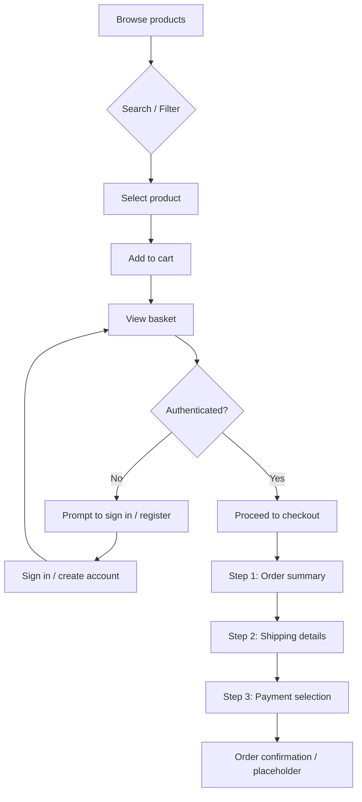

# Modern E-commerce Platform

A full‑stack B2C/B2B online shopping application built with React and Firebase. This university project demonstrates a production‑quality front‑end user experience and an administrative dashboard, powered by Firebase services for authentication, data storage, and serverless functions.

> **Live demo:** (not available in the academic submission)

---

## 📌 Introduction

This project implements a modern e-commerce platform that allows customers to browse products, manage a shopping cart, and complete a secure checkout process. An administrator can manage the product catalogue, monitor users, and track basic sales information. The application solves the problem of providing a responsive, stateful web shop without requiring a traditional server backend by leveraging Firebase's cloud services.


---

## 🛠️ Tech Stack

| Category | Technologies | Purpose |
|----------|--------------|---------|
| **Frontend** | React 17, Vite | Component-driven UI and development tooling |
| | Redux, Redux Saga, Redux Persist | Global state management and side effects |
| | React Router DOM | Client‑side routing |
| | Formik & Yup | Form handling and validation |
| | Ant Design Icons, react‑select, react‑modal | UI components & icons |
| **Backend / Services** | Firebase Authentication | Email/password + OAuth providers (Google, Facebook, GitHub) |
| | Firebase Cloud Firestore | NoSQL document database for users, products, etc. |
| | Firebase Cloud Storage | Product image hosting |
| | Firebase Cloud Functions | Serverless logic (e.g. lowercasing product names) |
| **Styling** | SCSS (Sass) with custom SASS architecture | Responsive design and theming |
| **Other** | Jest & Enzyme | Unit testing framework |
| | Yarn | Package manager |


---

## ✨ Key Features

### Customer Side

* **Product Browsing** – Grid and list views with pagination and featured/recommended sections.
* **Search & Filter** – Full‑text and keyword search, price range, brand filters, sorting options.
* **Shopping Cart** – Add/remove items, persist basket in Firestore when signed in.
* **Secure Checkout** – Three‑step process (summary, shipping, payment) with client‑side validation.
* **User Profile** – View/edit profile, address, and mobile number; placeholder for order history.

### Admin Dashboard

* **Inventory Management** – Create, read, update, delete (CRUD) products, including images and metadata such as keywords, sizes, colors, featured/recommended flags.
* **User Management** – Promote normal users to admins by editing the Firestore role field.
* **Order Tracking** – Placeholder component indicating where order tracking could be implemented.
* **Revenue Analytics** – Basic subtotal calculations in the checkout flow; full analytics would be an extension.


---

## 🗂️ Project Structure

```
src/
├─ components/          # Reusable components (basket, common UI, form controls)
├─ constants/           # Route paths, action type constants
├─ helpers/             # Utility functions (e.g. displayMoney)
├─ hooks/               # Custom React hooks (useBasket, useModal, etc.)
├─ redux/               # Actions, reducers, sagas, store configuration
├─ routers/             # Route definitions & custom route components
├─ services/            # Firebase wrapper and API helpers
├─ styles/              # SCSS architecture (settings, tools, components, utils)
├─ views/               # Page‑level components organized by feature (account, admin, checkout, home, etc.)
└─ App.jsx, index.jsx   # Application entry points
```

Key files:

* `src/services/firebase.js` – abstraction over Firebase SDK; contains all Firestore and Auth calls.
* `src/redux/sagas` – side‑effect logic connecting UI actions to Firebase operations.
* `src/views/admin/components/ProductForm.jsx` – form used for both adding and editing products.
* `functions/index.js` – Cloud Function that ensures `name_lower` field for search.


---

## 🧬 Database Schema

**Collections:** `users`, `products` (additional `orders` may be added later).

### User document

```
{
  fullname: string,
  avatar: string (URL),
  banner: string (URL),
  email: string,
  address: string,
  basket: array of product objects,
  mobile: { country, countryCode, dialCode, value },
  role: 'USER' | 'ADMIN',
  dateJoined: timestamp
}
```

Relationships: each user may have a `basket` array referencing product IDs and selected options; orders would reference user ID.

### Product document

```
{
  name: string,
  name_lower: string,          // added by cloud function for case‑insensitive search
  brand: string,
  price: number,
  maxQuantity: number,
  description: string,
  keywords: array<string>,
  sizes: array<string>,
  availableColors: array<string>,
  image: string (URL),
  imageCollection: array<{id:string,url:string}>,
  quantity: number,
  dateAdded: timestamp,
  isFeatured: boolean,
  isRecommended: boolean
}
```

Relationships: products are independent documents; orders (if implemented) would store product snapshots or references.


---

## 🚀 Installation & Setup

1. **Clone the repository**
   ```bash
   git clone https://github.com/your‑username/ecommerce-react.git
   cd ecommerce-react
   ```

2. **Install dependencies**
   ```bash
   yarn install
   ```

3. **Firebase project configuration**
   * Create a Firebase project at https://console.firebase.google.com
   * Enable **Authentication** (Email/Password + Google/Facebook/GitHub providers)
   * Enable **Firestore** (start in test mode for development)
   * Enable **Storage** (for product images)
   * Copy your project's configuration and populate a `.env` file in the project root:
     ```env
     VITE_FIREBASE_API_KEY=...
     VITE_FIREBASE_AUTH_DOMAIN=...
     VITE_FIREBASE_DB_URL=...
     VITE_FIREBASE_PROJECT_ID=...
     VITE_FIREBASE_STORAGE_BUCKET=...
     VITE_FIREBASE_MSG_SENDER_ID=...
     VITE_FIREBASE_APP_ID=...
     ```

4. **Run the development server**
   ```bash
   yarn dev
   ```
   The application will be available at `http://localhost:5173` (default Vite port).

5. **Deploy (optional)**
   * Build the static site: `yarn build`
   * Host the contents of `dist/` on any static hosting service or use Firebase Hosting.
   * Deploy Cloud Functions with `firebase deploy --only functions` if you wish to use the lowercase name trigger.

6. **Admin setup**
   * Register an account via `/signup`.
   * In the Firestore console navigate to the `users` collection and change your document's `role` field from `USER` to `ADMIN`.
   * Reload the site and the admin routes become available.


---

## 🔗 API Endpoints (Firebase)

Since this is a serverless application, there are no traditional REST endpoints. Instead, the client interacts directly with Firebase via the wrapper in `src/services/firebase.js`.

| Action | Firestore Collection | Description |
|--------|----------------------|-------------|
| `addUser` | `users` | Create new user document on signup |
| `getUser` | `users` | Fetch profile data |
| `saveBasketItems` | `users` | Persist shopping cart |
| `getProducts` | `products` | Paginated product list |
| `searchProducts` | `products` | Keyword or name search |
| `addProduct` / `editProduct` / `removeProduct` | `products` | Admin CRUD operations |

A Cloud Function (`lowercaseProductName`) triggers on new product documents to populate the `name_lower` field.


---

## 📊 User Purchase Flow




---

## ✅ Usage Notes (for Academic Submission)

* **Quality standards** – Codebase uses ESLint (Airbnb) and conforms to modular React architecture.
* **Extensibility** – The skeleton supports extensions such as order persistence, analytics, and real payment gateway integration (Stripe/PayPal) in the checkout step.
* **Testing** – Basic Jest/Enzyme configuration is included; tests reside in `test/` directory.


---

This README provides a comprehensive guide suitable for university project evaluation and demonstrates both technical competency and professional documentation practices.


