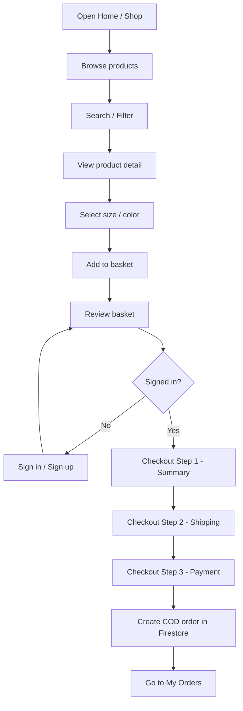
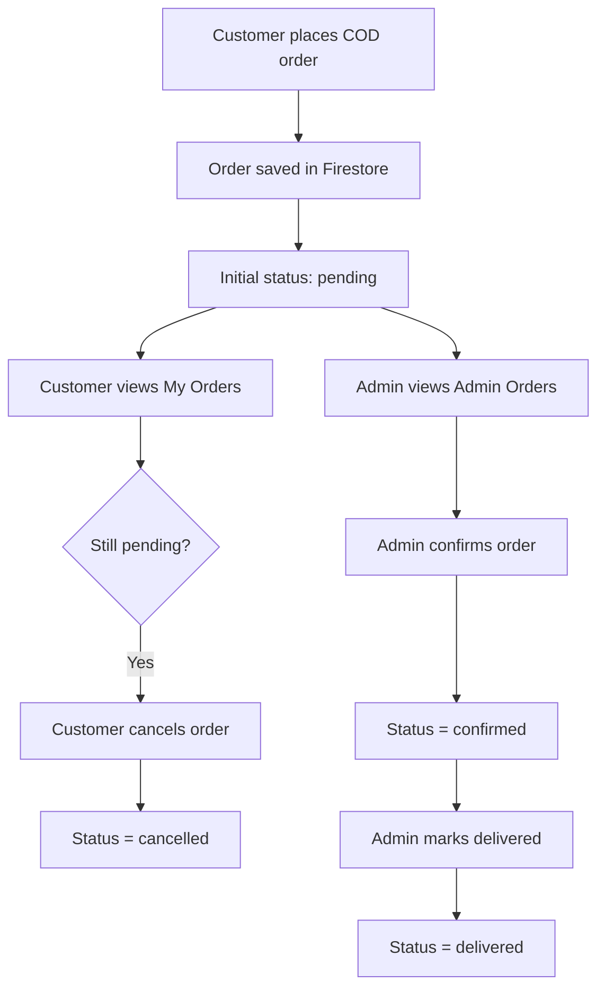

# Modern E-commerce Platform

A React + Firebase e-commerce web app for menswear, with customer shopping flows, admin product/order management, and an AI stylist chat assistant.

**Live Demo:**  
https://fashion-ecomerce-web.vercel.app/

---

## Project Overview

`LORDMEN` is a single-page ecommerce application built around 2 roles:

- **Customer**: browse products, search/filter, add to basket, checkout, manage profile, view/cancel orders.
- **Admin**: manage products and review/update customer orders.

The app uses Firebase directly from the frontend:

- **Firebase Auth** for sign in / sign up / OAuth
- **Cloud Firestore** for `users`, `products`, `orders`
- **Cloud Storage** for product and profile images
- **Cloud Functions** for product name normalization
- **Gemini API** for the Stylist AI chat assistant

---

## Tech Stack

- **Frontend:** React 17, Vite, React Router DOM 5
- **State management:** Redux, Redux Saga, Redux Persist
- **Forms:** Formik, Yup
- **UI:** SCSS, Ant Design Icons, react-select, react-modal
- **Backend services:** Firebase Auth, Firestore, Storage, Cloud Functions
- **AI integration:** Gemini API via `src/services/chatService.jsx`
- **Testing:** Jest, Enzyme

---

## Key Features

### Customer Features

- Home page with featured and recommended products
- Product listing, detail page, search, filter, and sorting
- Basket management with persistence for signed-in users
- 3-step checkout flow
- COD order creation
- Account profile editing with avatar/banner upload
- Order history with customer-side cancel for pending orders
- AI stylist chatbox with product-aware recommendations

### Admin Features

- Product CRUD
- Upload thumbnail and gallery images
- Manage featured / recommended products
- Review all customer orders
- Update order status: `pending -> confirmed -> delivered`

### Current Limitations

- Wish list tab is still a placeholder
- Credit card / PayPal UI exists, but live payment gateway integration is not implemented
- Admin dashboard is minimal, not a full analytics dashboard

---

## Main User Flow



---

## Order Flow



---

## Project Structure

```text
src/
|-- components/      # Reusable UI: basket, common, chatbox, product
|-- constants/       # Routes and Redux constants
|-- helpers/         # Utility helpers
|-- hooks/           # Custom hooks
|-- redux/           # Actions, reducers, sagas, store
|-- routers/         # Public / client / admin route guards
|-- selectors/       # Product filtering selectors
|-- services/        # Firebase wrapper and AI chat service
|-- styles/          # SCSS and chatbox styles
|-- views/           # Page-level screens
|-- App.jsx
`-- index.jsx
```

---

## Firestore Collections

### `users`

Stores:

- profile info
- basket
- role (`USER` / `ADMIN`)

### `products`

Stores:

- product info
- price, sizes, colors
- image + image collection
- featured / recommended flags
- normalized search fields such as `name_lower`

### `orders`

Stores:

- `userId`
- customer snapshot
- ordered items
- shipping info
- payment info
- pricing totals
- status: `pending`, `confirmed`, `delivered`, `cancelled`

---

## Setup

### 1. Install

```bash
npm install
```

or

```bash
yarn install
```

### 2. Environment Variables

Create `.env`:

```env
VITE_FIREBASE_API_KEY=...
VITE_FIREBASE_AUTH_DOMAIN=...
VITE_FIREBASE_DB_URL=...
VITE_FIREBASE_PROJECT_ID=...
VITE_FIREBASE_STORAGE_BUCKET=...
VITE_FIREBASE_MSG_SENDER_ID=...
VITE_FIREBASE_APP_ID=...
VITE_GEMINI_API_KEY=...
VITE_GEMINI_MODELS=gemini-2.5-flash,gemini-2.0-flash
```

### 3. Enable Firebase Services

- Authentication
- Cloud Firestore
- Cloud Storage
- Cloud Functions

### 4. Run locally

```bash
npm run dev
```

### 5. Make yourself admin

After registering, update your Firestore `users/{uid}.role` to:

```text
ADMIN
```

---

