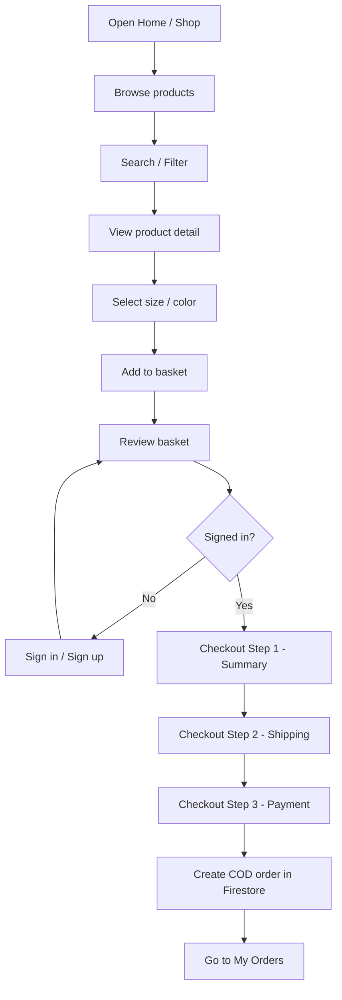
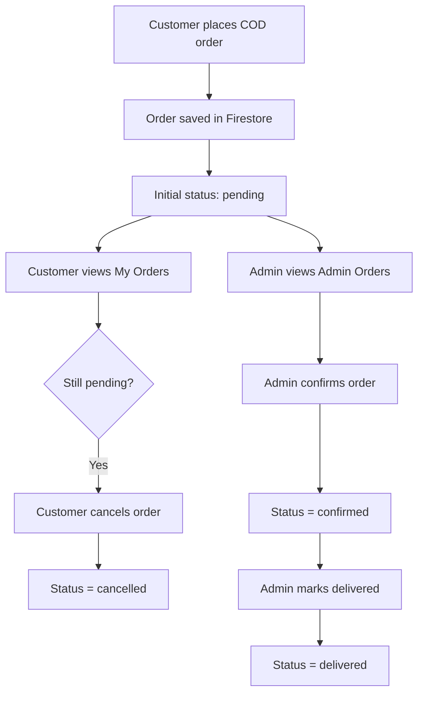
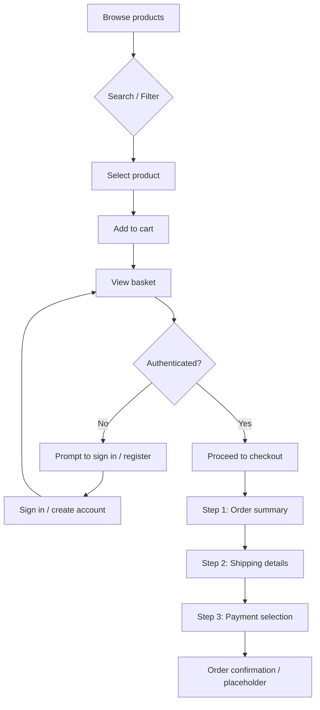

# Modern E-commerce Platform

A React + Firebase e-commerce web app for menswear, with customer shopping flows, admin product/order management, and an AI stylist chat assistant.

**Live Demo:**  
https://fashion-ecomerce-web.vercel.app/

---

## Project Overview

`LORDMEN` is a single-page ecommerce application built around 2 roles:

- **Customer**: browse products, search/filter, add to basket, checkout, manage profile, view/cancel orders.
- **Admin**: manage products and review/update customer orders.

The app uses Firebase directly from the frontend:

- **Firebase Auth** for sign in / sign up / OAuth
- **Cloud Firestore** for `users`, `products`, `orders`
- **Cloud Storage** for product and profile images
- **Cloud Functions** for product name normalization
- **Gemini API** for the Stylist AI chat assistant

---

## Tech Stack

- **Frontend:** React 17, Vite, React Router DOM 5
- **State management:** Redux, Redux Saga, Redux Persist
- **Forms:** Formik, Yup
- **UI:** SCSS, Ant Design Icons, react-select, react-modal
- **Backend services:** Firebase Auth, Firestore, Storage, Cloud Functions
- **AI integration:** Gemini API via `src/services/chatService.jsx`
- **Testing:** Jest, Enzyme

---

## Key Features

### Customer Features

- Home page with featured and recommended products
- Product listing, detail page, search, filter, and sorting
- Basket management with persistence for signed-in users
- 3-step checkout flow
- COD order creation
- Account profile editing with avatar/banner upload
- Order history with customer-side cancel for pending orders
- AI stylist chatbox with product-aware recommendations

### Admin Features

- Product CRUD
- Upload thumbnail and gallery images
- Manage featured / recommended products
- Review all customer orders
- Update order status: `pending -> confirmed -> delivered`

### Current Limitations

- Wish list tab is still a placeholder
- Credit card / PayPal UI exists, but live payment gateway integration is not implemented
- Admin dashboard is minimal, not a full analytics dashboard

---

## Main User Flow



---

## Order Flow



---

## Project Structure

```text
src/
|-- components/      # Reusable UI: basket, common, chatbox, product
|-- constants/       # Routes and Redux constants
|-- helpers/         # Utility helpers
|-- hooks/           # Custom hooks
|-- redux/           # Actions, reducers, sagas, store
|-- routers/         # Public / client / admin route guards
|-- selectors/       # Product filtering selectors
|-- services/        # Firebase wrapper and AI chat service
|-- styles/          # SCSS and chatbox styles
|-- views/           # Page-level screens
|-- App.jsx
`-- index.jsx
```

### Important Files

- `src/services/firebase.js` - Firebase Auth / Firestore / Storage wrapper
- `src/services/chatService.jsx` - Gemini prompt + product ranking logic
- `src/components/chatbox/ChatBox.jsx` - floating AI chat UI
- `src/redux/sagas/authSaga.js` - auth flow
- `src/redux/sagas/productSaga.js` - product loading / CRUD / search
- `src/views/checkout/step3/index.jsx` - order creation
- `src/views/account/components/UserOrdersTab.jsx` - customer orders
- `src/views/admin/orders/index.jsx` - admin orders

---

## Firestore Collections

### `users`

Stores:

- profile info
- basket
- role (`USER` / `ADMIN`)

### `products`

Stores:

- product info
- price, sizes, colors
- image + image collection
- featured / recommended flags
- normalized search fields such as `name_lower`

### `orders`

Stores:

- `userId`
- customer snapshot
- ordered items
- shipping info
- payment info
- pricing totals
- status: `pending`, `confirmed`, `delivered`, `cancelled`

---

## Setup

### 1. Install

```bash
npm install
```

or

```bash
yarn install
```

3. **Firebase project configuration**
   * Create a Firebase project at https://console.firebase.google.com
   * Enable **Authentication** (Email/Password + Google/Facebook/GitHub providers)
   * Enable **Firestore** (start in test mode for development)
   * Enable **Storage** (for product images)
   * Copy your project's configuration and populate a `.env` file in the project root:
     ```env
     VITE_FIREBASE_API_KEY=...
     VITE_FIREBASE_AUTH_DOMAIN=...
     VITE_FIREBASE_DB_URL=...
     VITE_FIREBASE_PROJECT_ID=...
     VITE_FIREBASE_STORAGE_BUCKET=...
     VITE_FIREBASE_MSG_SENDER_ID=...
     VITE_FIREBASE_APP_ID=...
     # If using third‑party chat service, include keys here (example):
     # VITE_CHAT_API_ENDPOINT=https://...
     # VITE_CHAT_API_KEY=...
     ```

4. **Run the development server**
   ```bash
   yarn dev
   ```
   The application will be available at `http://localhost:5173` (default Vite port).

5. **Deploy (optional)**
   * Build the static site: `yarn build`
   * Host the contents of `dist/` on any static hosting service or use Firebase Hosting.
   * Deploy Cloud Functions with `firebase deploy --only functions` if you wish to use the lowercase name trigger.

6. **Admin setup**
   * Register an account via `/signup`.
   * In the Firestore console navigate to the `users` collection and change your document's `role` field from `USER` to `ADMIN`.
   * Reload the site and the admin routes become available.


---

## 🔗 API Endpoints (Firebase)

Since this is a serverless application, there are no traditional REST endpoints. Instead, the client interacts directly with Firebase via the wrapper in `src/services/firebase.js`.

| Action | Firestore Collection | Description |
|--------|----------------------|-------------|
| `addUser` | `users` | Create new user document on signup |
| `getUser` | `users` | Fetch profile data |
| `saveBasketItems` | `users` | Persist shopping cart |
| `getProducts` | `products` | Paginated product list |
| `searchProducts` | `products` | Keyword or name search |
| `addProduct` / `editProduct` / `removeProduct` | `products` | Admin CRUD operations |

A Cloud Function (`lowercaseProductName`) triggers on new product documents to populate the `name_lower` field.


---

## 📊 User Purchase Flow




---

## ✅ Usage Notes (for Academic Submission)

* **Quality standards** – Codebase uses ESLint (Airbnb) and conforms to modular React architecture.
* **Extensibility** – The skeleton supports extensions such as order persistence, analytics, and real payment gateway integration (Stripe/PayPal) in the checkout step.
* **Testing** – Basic Jest/Enzyme configuration is included; tests reside in `test/` directory.


---


